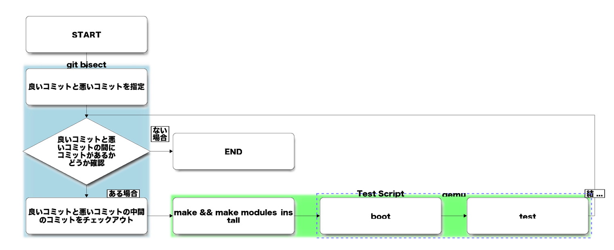

# git bisect を使って、kernel のバグが発生したコミットや挙動等が変更されたコミットを特定する

* [元ネタ](#%E5%85%83%E3%83%8D%E3%82%BF)
* [概要](#%E6%A6%82%E8%A6%81)
* [qemu 環境構築](#qemu-%E7%92%B0%E5%A2%83%E6%A7%8B%E7%AF%89)
  * [rootfs の作成](#rootfs-%E3%81%AE%E4%BD%9C%E6%88%90)
    * [手順](#%E6%89%8B%E9%A0%86)
      * [8G の Sparse file を作成](#8g-%E3%81%AE-sparse-file-%E3%82%92%E4%BD%9C%E6%88%90)
      * [debootstrap で debian イメージを作成](#debootstrap-%E3%81%A7-debian-%E3%82%A4%E3%83%A1%E3%83%BC%E3%82%B8%E3%82%92%E4%BD%9C%E6%88%90)
  * [kernel の build](#kernel-%E3%81%AE-build)
    * [menuconfig](#menuconfig)
    * [module](#module)
      * [1. 必要な物をすべて built-in](#1-%E5%BF%85%E8%A6%81%E3%81%AA%E7%89%A9%E3%82%92%E3%81%99%E3%81%B9%E3%81%A6-built-in)
      * [2. initrd/initramfs を利用](#2-initrd/initramfs-%E3%82%92%E5%88%A9%E7%94%A8)
      * [3. 9p（Plan 9 Filesystem Protocol）でホストの指定ディレクトリを /lib/modules でマウント](#3-9p%EF%BC%88plan-9-filesystem-protocol%EF%BC%89%E3%81%A7%E3%83%9B%E3%82%B9%E3%83%88%E3%81%AE%E6%8C%87%E5%AE%9A%E3%83%87%E3%82%A3%E3%83%AC%E3%82%AF%E3%83%88%E3%83%AA%E3%82%92-/lib/modules-%E3%81%A7%E3%83%9E%E3%82%A6%E3%83%B3%E3%83%88)
      * [4. boot する rootfs の /lib/modules を置き換え](#4-boot-%E3%81%99%E3%82%8B-rootfs-%E3%81%AE-/lib/modules-%E3%82%92%E7%BD%AE%E3%81%8D%E6%8F%9B%E3%81%88)
  * [ネットワーク設定](#%E3%83%8D%E3%83%83%E3%83%88%E3%83%AF%E3%83%BC%E3%82%AF%E8%A8%AD%E5%AE%9A)
  * [qemu の起動設定](#qemu-%E3%81%AE%E8%B5%B7%E5%8B%95%E8%A8%AD%E5%AE%9A)
  * [テストスクリプトの作成](#%E3%83%86%E3%82%B9%E3%83%88%E3%82%B9%E3%82%AF%E3%83%AA%E3%83%97%E3%83%88%E3%81%AE%E4%BD%9C%E6%88%90)
* [git bisect を実行する](#git-bisect-%E3%82%92%E5%AE%9F%E8%A1%8C%E3%81%99%E3%82%8B)
  * [git bisect とは](#git-bisect-%E3%81%A8%E3%81%AF)
  * [テストの実行](#%E3%83%86%E3%82%B9%E3%83%88%E3%81%AE%E5%AE%9F%E8%A1%8C)
  * [結果の確認方法](#%E7%B5%90%E6%9E%9C%E3%81%AE%E7%A2%BA%E8%AA%8D%E6%96%B9%E6%B3%95)
* [まとめ](#%E3%81%BE%E3%81%A8%E3%82%81)
* [TIPS](#tips)
* [その他参考サイト](#%E3%81%9D%E3%81%AE%E4%BB%96%E5%8F%82%E8%80%83%E3%82%B5%E3%82%A4%E3%83%88)

## 元ネタ

[Tracking down a kernel bug with git bisect](http://blog.oddbit.com/2014/07/21/tracking-down-a-kernel-bug-wit/)

[本の虫: Linuxカーネルのバグをgit bisectで特定する話](http://cpplover.blogspot.jp/2014/07/linuxgit-bisect.html) 元ネタの翻訳記事 

## 概要

基本的には元ネタの記事に書いてあるとおりです。ただし、一部手抜きなどしています。

やっていることを絵にするとこのような感じになります。



`git bisect run` を使えば、これが自動で行われます。

## qemu 環境構築

qemu の環境を触るのは初めてなので間違いがあるかもしれません。

今回は以下の様な構成で作業を行います。

* rootfs は`debootstrap`で作成した **Debian GNU/Linux 7 (wheezy)**
* kernel は入替えを楽にできるように `--kernel` で指定し、起動に必要なモジュールは全て組み込み
* 上記理由により、initrd(initramfs) は利用しない
* テストなどで利用する外部のモジュール類は 9p（Plan 9 Filesystem Protocol）（Virtualbox のファイル共有みたいなもの）でホストのディレクトリをマウントして、rootfs をさわらないでいいようにする。

### rootfs の作成

手順の概要は以下の様になります。

* ディスクイメージを作成する（今回は raw フォーマット、慣れていない qcow は不安だったため）
* ブートイメージは debootstrap で作成する。

#### 手順

##### 8G の Sparse file を作成

参考: [Sparse File (スパースファイル/穴空きファイル) - うまいぼうblog](http://d.hatena.ne.jp/hogem/20110215/1298047477)

スパースファイルのサイズを確認する場合は、du がおすすめです。

```console

# dd if=/dev/zero of=./debian.img seek=8000 bs=1M count=0
# ls -lh ../qemu/debian.img
-rw-r--r-- 1 root root 7.9G Jul 31 04:15 debian.img
# du -h debian.img
0       debian.img

```

##### debootstrap で debian イメージを作成

参考: [Docker向けのコンテナをゼロから作ってみよう - さくらのナレッジ](http://knowledge.sakura.ad.jp/tech/2226/)

```console

# # ファイルシステムを作成
# mkfs.ext4 ./debian.img
mke2fs 1.42.5 (29-Jul-2012)
./debian.img is not a block special device.
Proceed anyway? (y,n) y
Discarding device blocks: done
Filesystem label=
OS type: Linux
Block size=4096 (log=2)
Fragment size=4096 (log=2)
Stride=0 blocks, Stripe width=0 blocks
512064 inodes, 2048000 blocks
102400 blocks (5.00%) reserved for the super user
First data block=0
Maximum filesystem blocks=2097152000
63 block groups
32768 blocks per group, 32768 fragments per group
8128 inodes per group
Superblock backups stored on blocks:
        32768, 98304, 163840, 229376, 294912, 819200, 884736, 1605632
Allocating group tables: done
Writing inode tables: done
Creating journal (32768 blocks): done
Writing superblocks and filesystem accounting information: done

# # マウントする
# mkdir ./debian
# mount -o loop ./debian.img ./debian/
# # 確認
# mountpoint ./debian/
./debian/ is a mountpoint
# grep mountpoint /proc/mounts
/dev/loop2 /opt/local/qemu/debian ext4 rw,relatime,data=ordered 0 0

# # debootstrap で Debian GNU/Linux 7.6 (wheezy) をインストール
# # debootstrap は apt-get install debootstrap で入る
# debootstrap wheezy ./debian/ http://debian-mirror.sakura.ne.jp/debian/
I: Retrieving Release
I: Retrieving Release.gpg
I: Checking Release signature
~snip~
I: Configuring aptitude...
I: Configuring tasksel...
I: Configuring tasksel-data...
I: Base system installed successfully.
# # 動作確認
# chroot ./debian /bin/bash
# cat /etc/debian_version
7.6

```

### kernel の build

kernel の build は `git bisect` で呼び出すスクリプト内で実行するが、その前に1度は手動で実行して動作確認しておくべきです。

ここでは、`git bisect` で呼ぶスクリプトに記載するときの注意点を記述します。

#### menuconfig

スクリプト内で実行するので当然 `make menuconfig` は使えないです。このような場合にお勧めなのが `make olddefconfig`。古い **.config** を元に新しい機能は自動的に default になった **.config** を生成してくれます。ただし、kernel 3.8 以降のみしかサポートされていないようです。3.8以前ならば `make silentoldconfig` が良いかもしれません（未確認）。

参考: [カーネル/VM Advent Calendar 6日目: make *config ～カーネルいじっちゃお!～ - Emacs ひきこもり生活](http://d.hatena.ne.jp/meech/20101212/1292165676)

#### module

テストなので kernel を build するたびに当然ながら module も更新しないといけないですが、これをどのように配置するかが問題です。kernel 本体は qemu の起動オプション `--kernel` で指定するので、問題ないですが、module は別の方法で qemu で起動した後に見えるようにしてあげないとダメです。

対処方法は以下4つぐらいがあると思います。今回は 3 を採用しました。

##### 1. 必要な物をすべて built-in

起動や、動作に必要なものをすべて build-in にしてしまう方法です。  
この方法はお手軽で良いが、 module 化での利用に関して調査するときや、組み込めないものなどでは使えないので注意が必要です。

##### 2. initrd/initramfs を利用

kernel の build 後に、module を組み込んだ initrd/initramfs を生成しそれを qemu の起動オプションで渡す方法です。  
build 後に initrd の生成を実施する必要があります（結構時間がかかります）。

##### 3. 9p（Plan 9 Filesystem Protocol）でホストの指定ディレクトリを /lib/modules でマウント

起動に必要な物は built-in にして、module で必要なものは 9p でマウントし読み込ませる方法です。  
9p 関連の Driver を built-in で入れる必要があります。

##### 4. boot する rootfs の /lib/modules を置き換え

起動に必要な物は built-in にして、module で必要なものは rootfs の中の /lib/modules を書き換えてしまう方法です。  
ファイルの不整合などが発生するので、起動のたびに rootfs を umount/mount をきちんとする必要があります。

### ネットワーク設定

今回のテストでは利用していないが、設定手順は今後必要になったら追加予定です。

### qemu の起動設定

上記を踏まえて、今回のテストで利用した qemu の起動オプションは以下です。

```bash

# qemu-system-x86_64 \
    -m 1024M \
    -machine accel=kvm \
    -drive file=/opt/local/qemu/debian.img,if=virtio \
    -kernel /opt/local/src/git.kernel.org/pub/scm/linux/kernel/git/stable/linux-stable/arch/x86_64/boot/bzImage \
    -fsdev local,id=fs0,path=/opt/local/qemu/mntpoint,security_model=none \
    -device virtio-9p-pci,fsdev=fs0,mount_tag=mntpoint \
    -netdev user,id=user.0 \
    -device virtio-net,netdev=user.0 \
    -append "root=/dev/vda" \
    -curses \

```

この場合、ホストの `/opt/local/mntpoint` が 9p で mount するときに mntpoint という target 名でみえます。

### テストスクリプトの作成

今回必要となるテストスクリプトは

1. kernel を build
2. qemu の引数に作った kernel を指定して起動
3. qemu 内で必要なテストを実行し結果を返す
4. 結果から OK なら 0 を、ダメなら 1 を返して終了

を満たす形になれば良いです。

今回利用したスクリプトは以下となります。


```bash

#!/bin/bash
# vi: set ts=4 sw=4 sts=0 et:

set -x
set -e

REPOS=/opt/local/src/git.kernel.org/pub/scm/linux/kernel/git/stable/linux-stable/
BASEDIR=/opt/local/qemu
MNTDIR=${BASEDIR}/mntpoint
rm -rf ${MNTDIR}/lib

cd ${REPOS}
make olddefconfig
make -j4
# module
# firmware は妥協
make INSTALL_MOD_PATH=${MNTDIR} modules_install
rm -vf ${MNTDIR}/lib/modules/*/{build,source}

# test
rm -vf ${MNTDIR}/test_result/*
cd ${BASEDIR}
qemu-system-x86_64 \
    -m 1024M \
    -machine accel=kvm \
    -drive file=/opt/local/qemu/debian.img,if=virtio \
    -kernel ${REPOS}/arch/x86_64/boot/bzImage \
    -fsdev local,id=fs0,path=${BASEDIR}/mntpoint,security_model=none \
    -device virtio-9p-pci,fsdev=fs0,mount_tag=mntpoint \
    -netdev user,id=user.0 \
    -device virtio-net,netdev=user.0 \
    -append "root=/dev/vda" \
    -curses \

if grep OKAY ${MNTDIR}/test_result/stdout; then
    exit 0
else
    exit 1
fi

```

3 の qemu 内でのテストは rootfs の /etc/rc.local に以下を記述しています。

```bash

if ! mountpoint -q /mnt; then
  mount -t 9p -o trans=virtio mntpoint /mnt
fi

mount --bind /mnt/lib/modules /lib/modules
mount --bind /mnt/lib/firmware /lib/firmware

SCRIPT=/mnt/test_script.sh
if [ -x ${SCRIPT} ]; then
    bash ${SCRIPT} >/mnt/test_result/stdout 2>/mnt/test_result/stderr
fi
poweroff
exit 0

```

test_script.sh は qemu 内で実行したいテストを記述し、うまく行けば OKAY を返すように作れば良いです。


## git bisect を実行する

### git bisect とは

オープンソースのプログラムなどをバージョンアップして問題が発生したり、挙動が変わった時にどのコミットから発生したのか切り分けたいと思った事があると思います。

その場合、通常はコミットログやソースからそのコミットを探すと思いますが、対象となるコミットが非常に多かったりプロジェクトが大きくてソースから探すのが非常に困難である場合にその手助けとなるのが `git bisect` です。`git bisect` は、二分探索により対象のコミットを探してくれます。

参考: [AdventCalendar - git bisect で問題箇所を特定する - Qiita](http://qiita.com/usamik26/items/cce867b3b139ea5568a6)

### テストの実行

kernel を例として、「bonding ドライバで kernel 3.8 までは問題なかったようだが、kernel 3.9 を入れたら問題が発生した。」となった場合に kernel のレポジトリで以下のように実行します。

```console

$ # git bisect start <bad-commit> <good-commit>
$ git bisect start 'v3.9' 'v3.8'

```

これで、bisect の対象となるコミットの範囲が指定されます。

続いて、テストスクリプトを指定し実行させます。今回は前述の qemu を起動するテストスクリプトを `kernel-test.sh` として用意したので、以下のようにします。

```console

$ git bisect run ./kernel-test.sh


```

この結果、kernel の v3.8 のタグから v3.9 のタグまでを二分探索でチェックアウトしてきて、kernel を build し qemu で起動してテストを行い OKAY が出るかどうかの境目のコミットを探してくれます。
kernel v3.8 から v3.9 まででのコミットは 6477 なので 13回ぐらいのテストで対象コミットを特定可能です。

### 結果の確認方法

テストが終わったら、`git bisect log` で対象コミットや途中でテストを行ったコミットを確認できます。

今回のテストの場合は以下の様になります。

```console

# git bisect log                                                                               [12/1961]
# bad: [c1be5a5b1b355d40e6cf79cc979eb66dafa24ad1] Linux 3.9
# good: [19f949f52599ba7c3f67a5897ac6be14bfcb1200] Linux 3.8
git bisect start 'v3.9' 'v3.8'
# bad: [d778df51c09264076fe0208c099ef7d428f21790] mm: vmscan: save work scanning (almost) empty LRU lists
git bisect bad d778df51c09264076fe0208c099ef7d428f21790
# bad: [3278bb748d2437eb1464765f36429e5d6aa91c38] ocfs2: unlock super lock if lockres refresh failed
git bisect bad 3278bb748d2437eb1464765f36429e5d6aa91c38
# bad: [c6b538079723efd21b5fd7e3091dc47dbd0436c4] Merge branch 'for-davem' of git://git.kernel.org/pub/scm/linux/kernel/git/linville/wireless-next
git bisect bad c6b538079723efd21b5fd7e3091dc47dbd0436c4
# bad: [1b13c97fae9c61dc20db8e0d0a72a29df29ac377] net/vxlan: Add ethtool drvinfo
git bisect bad 1b13c97fae9c61dc20db8e0d0a72a29df29ac377
# good: [b205c0de495ea0a7cd073ff92b47a480c1b24ebe] ixgbe: only compile ixgbe_debugfs.o when enabled
git bisect good b205c0de495ea0a7cd073ff92b47a480c1b24ebe
# good: [50c2f5e8f93c83ddb7fe74057db1e3030724ae6e] Merge tag 'nfc-next-3.9-1' of git://git.kernel.org/pub/scm/linux/kernel/git/sameo/nfc-next
git bisect good 50c2f5e8f93c83ddb7fe74057db1e3030724ae6e
# good: [8a67b05db93688600ca330692b87668cad37e507] Merge branch 'master' of git://git.kernel.org/pub/scm/linux/kernel/git/jkirsher/net-next
git bisect good 8a67b05db93688600ca330692b87668cad37e507
# good: [ce4a600e477a4da600c8056897e71e2f4a8c5ac0] Merge branch 'for-davem' of git://git.kernel.org/pub/scm/linux/kernel/git/linville/wireless-next
git bisect good ce4a600e477a4da600c8056897e71e2f4a8c5ac0
# good: [ee873fda3bec7c668407b837fc5519eb961fcd37] gianfar: Pack struct gfar_priv_grp into three cachelines
git bisect good ee873fda3bec7c668407b837fc5519eb961fcd37
# bad: [069048f18bc51fbfd08d2e08a9003c2681ce44dd] qlcnic: Fix sparse check endian warnings
git bisect bad 069048f18bc51fbfd08d2e08a9003c2681ce44dd
# good: [ff88b30c717f21dffba6784cae4d3287da16f6ef] xfrm: Use ipv6_addr_equal() where appropriate.
git bisect good ff88b30c717f21dffba6784cae4d3287da16f6ef
# good: [29e3b1608c8dca3ae4224a26862d18ea003ccee6] netfilter ipset: Use ipv6_addr_equal() where appropriate.
git bisect good 29e3b1608c8dca3ae4224a26862d18ea003ccee6
# bad: [409cc1f8a4149c26bbb8e5d3bacb36541ad371e2] bond: have random dev address by default instead of zeroes
git bisect bad 409cc1f8a4149c26bbb8e5d3bacb36541ad371e2
# good: [d2ed273d30c5ffd14f6b5ec7ecc751d960f832fc] net: disallow drivers with buggy VLAN accel to register_netdevice()
git bisect good d2ed273d30c5ffd14f6b5ec7ecc751d960f832fc

```


## まとめ

* git bisect を使うと膨大なコミットが存在するレポジトリから、ある変更やバグが仕込まれたコミットを探すことができます。
* kernel の場合は qemu を使うなどすることで利用可能です。
* テスト環境とテストスクリプトさえ用意できれば手でやって時間がかかる作業も寝てる間放置しておけばいいのでとても楽なので、調査に時間が掛かることが想定されたら先に仕込んでおいて他と平行して調査するのにお勧めです。

## TIPS

* テスト内容によるが、テスト実行時間のうちの8割は kernel build となる。そのため kernel は極力小さくするべきです。
* 小さな Kernel config を用意する方法としては、一度 qemu 上で起動してその上で `make localyesconfig` をするのがいいかもしれません。
  * vm でとった lsmod の結果を利用して `make LSMOD=lsmod.txt localyesconfig` をホストで実行してもよいでしょう。
  * 参考: [ホストに保存してある任意のカーネルでゲスト起動 - とみふらの明るく楽しい俺用wiki](https://sites.google.com/site/tomiflawiki/computer/kernel-hack/boot-guest-using-kernel-image-saved-in-host)

## その他参考サイト

[Kernel git-bisect - Gentoo Wiki](http://wiki.gentoo.org/wiki/Kernel_git-bisect)
