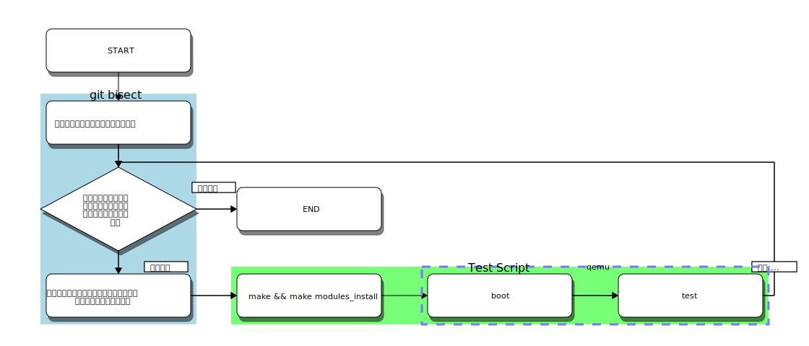

# git bisect を使って、kernel のバグが発生したコミットや挙動等が変更されたコミットを特定する

* [元ネタ](#%E5%85%83%E3%83%8D%E3%82%BF)
* [概要](#%E6%A6%82%E8%A6%81)
* [qemu 環境構築](#qemu-%E7%92%B0%E5%A2%83%E6%A7%8B%E7%AF%89)
  * [rootfs の作成](#rootfs-%E3%81%AE%E4%BD%9C%E6%88%90)
  * [kernel の build](#kernel-%E3%81%AE-build)
  * [ネットワーク設定](#%E3%83%8D%E3%83%83%E3%83%88%E3%83%AF%E3%83%BC%E3%82%AF%E8%A8%AD%E5%AE%9A)
  * [qemu の起動設定](#qemu-%E3%81%AE%E8%B5%B7%E5%8B%95%E8%A8%AD%E5%AE%9A)
  * [テストスクリプトの作成](#%E3%83%86%E3%82%B9%E3%83%88%E3%82%B9%E3%82%AF%E3%83%AA%E3%83%97%E3%83%88%E3%81%AE%E4%BD%9C%E6%88%90)
* [git bisect を実行する](#git-bisect-%E3%82%92%E5%AE%9F%E8%A1%8C%E3%81%99%E3%82%8B)
  * [git bisect とは](#git-bisect-%E3%81%A8%E3%81%AF)
  * [テストの実行](#%E3%83%86%E3%82%B9%E3%83%88%E3%81%AE%E5%AE%9F%E8%A1%8C)
  * [結果の確認方法](#%E7%B5%90%E6%9E%9C%E3%81%AE%E7%A2%BA%E8%AA%8D%E6%96%B9%E6%B3%95)
* [TIPS](#tips)
* [参考サイト](#%E5%8F%82%E8%80%83%E3%82%B5%E3%82%A4%E3%83%88)

## 元ネタ

[Tracking down a kernel bug with git bisect](http://blog.oddbit.com/2014/07/21/tracking-down-a-kernel-bug-wit/)

[本の虫: Linuxカーネルのバグをgit bisectで特定する話](http://cpplover.blogspot.jp/2014/07/linuxgit-bisect.html) 元ネタの翻訳記事 

## 概要

基本的には元ネタの記事に書いてあるとおり。ただし、一部手抜きなどしてる。

やってることはこんな感じ。

`git bisect run` を使えば、これが自動で行われる。

## qemu 環境構築

qemu の環境を触るのは初めてなので間違いがあるかも。

今回は以下の様な構成で作業を行う。

* rootfs は`debootstrap`で作成した **Debian GNU/Linux 7 (wheezy)**
* kernel は入替えを楽にできるように `--kernel` で指定し、起動に必要なモジュールは全て組み込み
* 上記理由により、initrd(initramfs) は利用しない
* テストなどで利用する外部のモジュール類は 9p（Plan 9 Filesystem Protocol）（Virtualbox のファイル共有みたいなもの）でホストのディレクトリをマウントして、rootfs をさわらないでいいようにする。

### rootfs の作成

手順の概要は以下の様な感じ。

* debootstrap で作成する。
* ディスクイメージは raw フォーマットにする。（#1）

### kernel の build

### ネットワーク設定

今回のテストでは利用していないが、設定手順は今後追加予定

### qemu の起動設定

### テストスクリプトの作成

## git bisect を実行する

### git bisect とは

[AdventCalendar - git bisect で問題箇所を特定する - Qiita](http://qiita.com/usamik26/items/cce867b3b139ea5568a6)

### テストの実行

### 結果の確認方法

## TIPS

* テスト内容によるが、テスト実行時間のうちの8割は kernel build となる。そのため kernel は極力小さくするべき。
* 小さな Kernel config を用意する方法としては、一度 qemu 上で起動してその上で `make localyesconfig` をするのがいいかも。
  * vm でとった lsmod の結果を利用して `make LSMOD=lsmod.txt localyesconfig` をホストで実行してもよい

## 参考サイト

[Kernel git-bisect - Gentoo Wiki](http://wiki.gentoo.org/wiki/Kernel_git-bisect)
